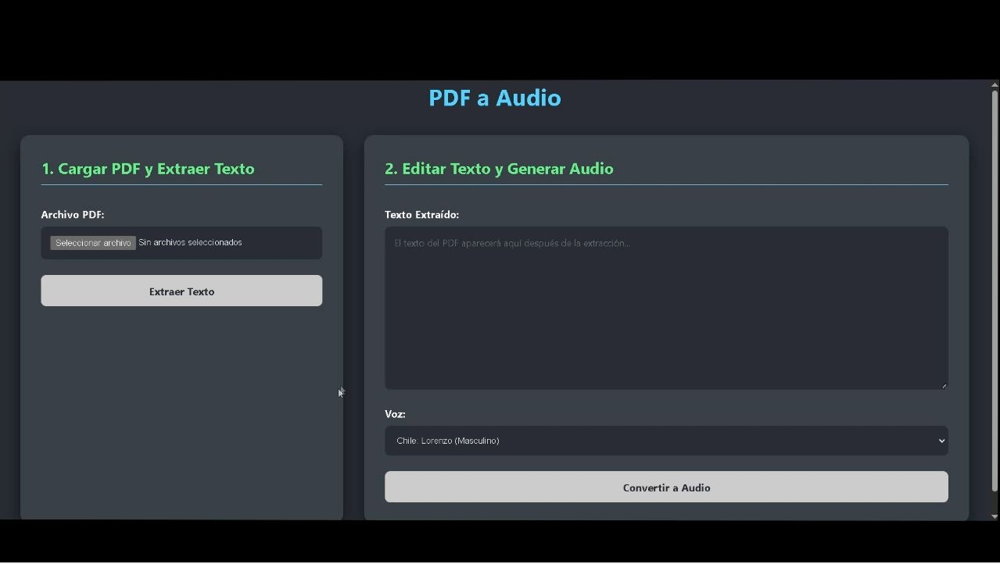

# PDF a Audio

Esta es una aplicación web full-stack que convierte archivos PDF a audio. Utiliza React para el frontend y Flask (Python) para el backend.

[](./video/Pdf_A_Audio_chico.mp4)

El backend se encarga de:
- Extraer texto de archivos PDF usando `PyMuPDF` y `pytesseract` (OCR).
- Convertir el texto extraído a audio usando `edge-tts`.

## Estructura del Proyecto

- **/frontend**: Contiene la aplicación de React.
- **/backend**: Contiene la aplicación de Flask.
  - `app.py`: El servidor principal de Flask.
  - `ocr_pdf_to_text.py`: Lógica para la extracción de texto y OCR.
  - `text_to_speech.py`: Lógica para la conversión de texto a voz.
  - `build.sh`: Script para instalar dependencias en plataformas como Render.
  - `.env`: Archivo para variables de entorno locales (solo para Windows).

---

## Ejecución

Hay dos modos de ejecución: Local (para desarrollo en Windows) y Despliegue (para servidores como Render).

### 1. Ejecución Local (Windows)

Este modo depende de una instalación manual de Tesseract-OCR.

**Requisitos:**
- Python 3.x
- Node.js y npm
- Tesseract-OCR instalado en el sistema.

**Pasos:**

1.  **Configurar el Backend:**
    - Navega a la carpeta `backend`.
    - Crea un entorno virtual: `python -m venv env`
    - Activa el entorno: `.\env\Scripts\activate`
    - Instala las dependencias: `pip install -r requirements.txt`
    - Crea un archivo `.env` y define las rutas a tu instalación de Tesseract:
      ```
      TESSERACT_CMD="C:\\Ruta\\A\\Tesseract-OCR\\tesseract.exe"
      TESSDATA_PREFIX="C:\\Ruta\\A\\Tesseract-OCR\\tessdata"
      ```
    - Ejecuta el servidor: `python app.py`

2.  **Configurar el Frontend:**
    - Abre otra terminal y navega a la carpeta `frontend`.
    - Instala las dependencias: `npm install`
    - Inicia la aplicación de React: `npm start`

### 2. Despliegue en Render (o similar)

Este modo es portable y no depende de instalaciones locales. Utiliza el script `build.sh` para configurar el entorno en el servidor.

**Configuración en Render:**

- **Servicio:** Crea un nuevo "Web Service".
- **Repositorio:** Conecta tu repositorio de GitHub.
- **Root Directory:** `backend` (para que Render sepa dónde encontrar el código a ejecutar).
- **Build Command:** `bash build.sh`
- **Start Command:** `gunicorn app:app` (Gunicorn es un servidor WSGI recomendado para producción).

Con esta configuración, Render instalará automáticamente Tesseract y las dependencias de Python antes de iniciar el servidor, haciendo el despliegue simple y autocontenido.

**Frontend en Render:**
- **Servicio:** Crea un nuevo "Static Site".
- **Repositorio:** Conecta el mismo repositorio.
- **Root Directory:** `frontend`
- **Build Command:** `npm install && npm run build`
- **Publish Directory:** `dist`

**Conectar Frontend y Backend:**
Una vez que ambos servicios estén desplegados, Render te dará una URL para cada uno (ej. `https://mi-backend.onrender.com` y `https://mi-frontend.onrender.com`).

1.  Ve a la configuración de tu servicio de **Frontend** en Render.
2.  Ve a la sección de "Environment" (Variables de Entorno).
3.  Añade una nueva variable de entorno:
    - **Key:** `VITE_API_BASE_URL`
    - **Value:** La URL de tu backend desplegado (ej. `https://mi-backend.onrender.com`)

Render reconstruirá tu frontend con esta variable, y a partir de ese momento, sabrá cómo comunicarse con tu backend.

---

# Frontend

Este frontend es una aplicación React que permite subir archivos PDF y convertirlos a audio usando el backend Flask.

## Requisitos
- Node.js >= 16
- npm >= 7

## Instalación y ejecución local

1. Navega a la carpeta `frontend`:
   ```sh
   cd frontend
   ```
2. Instala las dependencias:
   ```sh
   npm install
   ```
3. Crea un archivo `.env` en la raíz de `frontend` con la URL de tu backend:
   ```env
   VITE_API_BASE_URL=http://localhost:5000
   ```
   (Cambia la URL si tu backend está en otro host o puerto)
4. Inicia la aplicación:
   ```sh
   npm start
   ```

La app estará disponible en `http://localhost:3000`.

## Despliegue en Render

- **Servicio:** Static Site
- **Root Directory:** `frontend`
- **Build Command:** `npm install && npm run build`
- **Publish Directory:** `dist`
- **Variable de entorno:**
  - `VITE_API_BASE_URL` con la URL de tu backend desplegado

---
